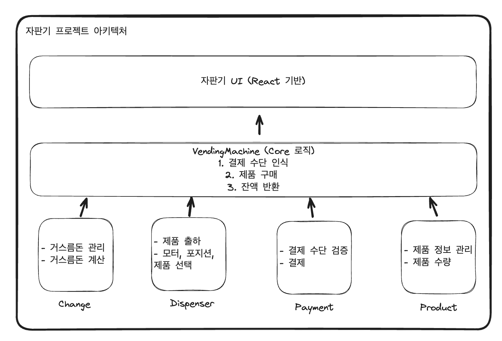
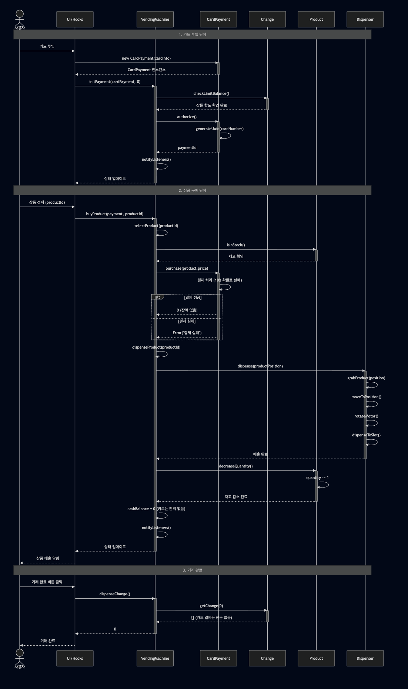
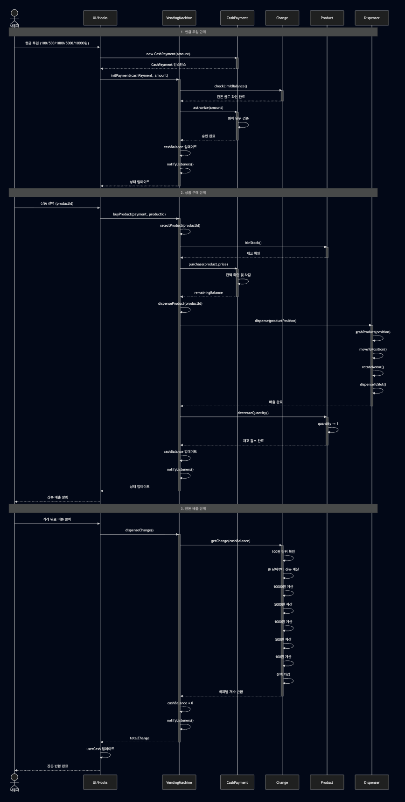

# 🥤 자판기 시뮬레이터

React + TypeScript로 구현한 자판기 시스템입니다.

## 📋 프로젝트 개요

실제 자판기의 동작을 시뮬레이션하는 웹 애플리케이션으로, 상품 선택, 결제, 거스름돈 반환 등의 기능을 구현했습니다.

## ✨ 주요 기능

- **상품 관리**: 상품의 재고 관리 및 구매 가능한 인터페이스 제공
- **결제 시스템**: 현금 및 카드 결제 지원
- **거스름돈 계산**: 최소 동전 개수로 거스름돈 반환
- **상품 배출**: 구매한 상품 배출 시뮬레이션

## 🏗️ 기술 스택 및 버전

- **프론트엔드**: React 19, TypeScript
- **빌드 도구**: Vite
- **테스트**: Vitest
- **node.js**: v22.20.0

## 📁 프로젝트 구조

```
src/
├── entities/          # 도메인 엔티티
│   ├── VendingMachine # 자판기 메인 로직
│   ├── Product        # 상품 관리
│   ├── Payment        # 결제 시스템 (현금/카드)
│   ├── Change         # 거스름돈 계산
│   └── Dispenser      # 상품 배출
├── page/              # UI 컴포넌트
└── shared/            # 공유 유틸리티
```

## 🚀 실행 방법

### 개발 서버 실행

```bash
npm install
npm run dev
```

### 테스트 실행

```bash
npm run test
```

### 프로덕션 빌드

```bash
npm run build
```

## 🧪 테스트

각 엔티티별로 단위 테스트가 작성되어 있습니다.

- VendingMachine 테스트
- Product 테스트
- Payment (현금/카드) 테스트
- Change 테스트
- Dispenser 테스트

## 📝 주요 설계 특징

- **도메인 중심 설계**: 비즈니스 로직을 엔티티로 분리
- **타입 안정성**: TypeScript로 타입 안전성 보장
- **테스트 커버리지**: 핵심 로직에 대한 테스트 작성
- **상태 관리**: Subscribable 패턴을 활용한 반응형 상태 관리

## 🏛️ 아키텍처



## 모듈 별 역할과 의도

> 기본적으로 VendingMachine 을 제외한 각각의 모듈은 타 모듈의 구현체에 의존적이지 않고,<br />
> 독립적으로 동작하는 방향을 지향했습니다.<br />
>
> 이를 통해 각 모듈은 본인들이 수행해야할 역할에만 집중하며,<br />
> 관리하는 데이터 또한 역할과 관련된 것을 다루도록 구현했습니다.

### 1. Change

#### 역할

거스름돈에 대한 계산과 검증을 담당

#### 의도

1. 화폐 단위 통일: 과제의 요구사항 중 사용자가 사용가능한 결제 수단이 제한되어 있습니다.
   이에 따라 거스름돈도 동일한 결제 수단(화폐 단위)를 사용하도록 제한을 두었습니다.

2. 거스름돈 제한: 일정 거스름돈 미만일 경우, 거스름돈을 전달해주지 못할 가능성이 높습니다.
   이에 따라 각 화폐 별 최소로 유지해야할 양을 정의하여 체크하는 method 를 구현했습니다.

3. 거스름돈 계산 로직 고도화: 지급해야할 거스름돈을 가장 큰 단위부터 작은 단위로 계산합니다.
   사용자 입장에서 작은 단위(동전)로 많은 거스름돈이 나오면 불편함을 겪으므로, 큰 단위부터 지급합니다.
   더 나아가 큰 단위의 화폐의 갯수가 모자를 경우, 바로 아래 단위의 화폐를 통해 지급하는 식으로 고도화 했습니다.

### 2. Dispenser

#### 역할

제품을 출하하는 과정을 담당

#### 의도

1. 관심사 분리: 제품을 출하하는 역할을 담당하므로 꼭 제품에 대한 의존성을 가질 필요는 없다고 생각했습니다.
   출하해야할 상품이 무엇인지는 관심사가 아니라고 판단했으며, 이에 따라 출하 제품의 포지션을 받는 방식으로 구현했습니다.
   _(포지션은 단순하게 인덱스로 대체)_

   이에 따라 Dispenser 는 전달받은 포지션의 제품을 잡고, 떨어뜨리는 행위에만 집중하도록 구현했습니다.

### 3. Payment

#### 역할

결제와 관련된 행위를 정의하고 관리를 담당

#### 의도

1. 결제 수단 추상화 및 일관성 보장: 결제 수단을 사용하는 쪽에서 일관성 있는 사용을 보장하기 위해 추상 클래스를 활용했습니다.
   각 결제 수단 별로 다른 인터페이스를 제공할 경우, 이를 사용하는 VendingMachine 에선 결제 수단 별 처리 로직이 생기고
   이는 관리하는데 큰 비용이 들어갑니다.

   이에 따라 자판기 시나리오에 필요한 `결제 수단 검증(authorize)`, `구매(purchase)` 를 공통으로 정의하도록 추상 클래스를 선언 후,
   카드와 현금 Class 는 추상 클래스 기반으로 구현했습니다.

### 4. Product

#### 역할

제품 수량, 정보에 대한 관리를 담당

#### 의도

1. 관심사 분리: 제품 관리와 관련된 로직만 집중할 수 있도록 구현했습니다. 해당 제품에 대한 재고 확인, 증감에 대한 기능을 제공하여
   제품과 관련된 로직은 Product Class 을 확인하면 된다는 생각을 유도하는 것을 목표로 했습니다.

### 5. VendingMachine

#### 역할

자판기에서 사용할 기능을 구현, 관련된 모듈을 호출, 조합하여 필요한 기능을 구현

#### 의도

1. 모듈을 통한 기능 구현: 디테일한 구현 사항은 관련된 모듈 method 를 활용하고, 이를 조합하여 구현하는 방향을 지향했습니다.
   이를 통해 디테일한 로직을 노출하지 않고, 해당 기능을 실행하면 어떤 흐름으로 동작할지 예측 가능하도록 구현했습니다.

2. 상태 관리: 1번 모듈을 통한 기능 구현을 통해 디테일한 로직을 노출하지 않고, 흐름만을 노출했습니다.
   이와 더불어 해당 Class 에서는 VendingMachine 에서 노출시켜야할 상태를 관리하고, 이를 외부에 어떻게 전달할지를 관리합니다.

## React & Core 로직 연동

기본적으로 VendingMachine 자체를 거대한 Store 의 개념이라고 생각하며 구현했습니다.
자판기의 상태 업데이트 주기와 React 라이프사이클을 맞추기 위해 React [useSyncExternalStore](https://ko.react.dev/reference/react/useSyncExternalStore) 을 활용했습니다.

VendingMachine public method 는 외부에서 사용할 수 있기에 해당 method 에서 `notifyListeners` 를 호출하여 React 라이프사이클에 맞물리는 방식으로 구현했습니다.
useSyncExternalStore 에선 구독과 관련된 규칙을 수행하며, Core 로직 관리 + 외부와의 연결을 담당하도록 구현했습니다.

## 동작 시퀀스 다이어그램

### 카드 결제 시퀀스 다이어그램



### 현금 결제 시퀀스 다이어그램



## AI 사용

1. 시퀀스 다이어그램 생성

- mermaid 기반 시퀀스 다이어그램을 생성하기 위해 구현된 아키텍처 기반 생성을 요청했습니다.

2. ui 코드 생성

- 빠른 개발을 위해 css, ui 구성 생성을 요청했습니다.
